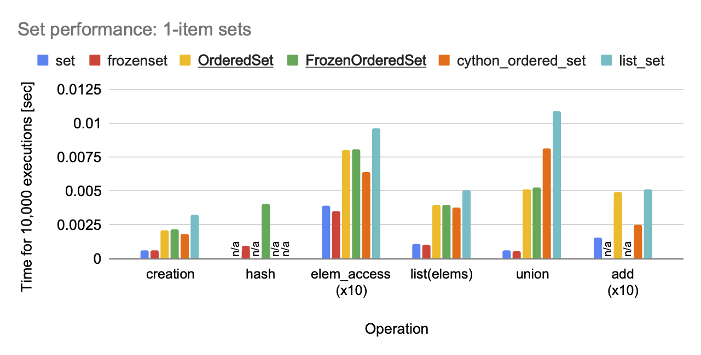

Speed comparison of set implementations
=======================================

Code
****

These results were generated with the following code, found in
`examples/speed.py <https://github.com/matthiasdiener/orderedsets/blob/main/examples/speed.py>`__ in the
source distribution:

.. literalinclude:: ../examples/speed.py
   :language: python

Results
*******

Results (total time of 10,0000 executions) for Python 3.11 on a Mac M1:

